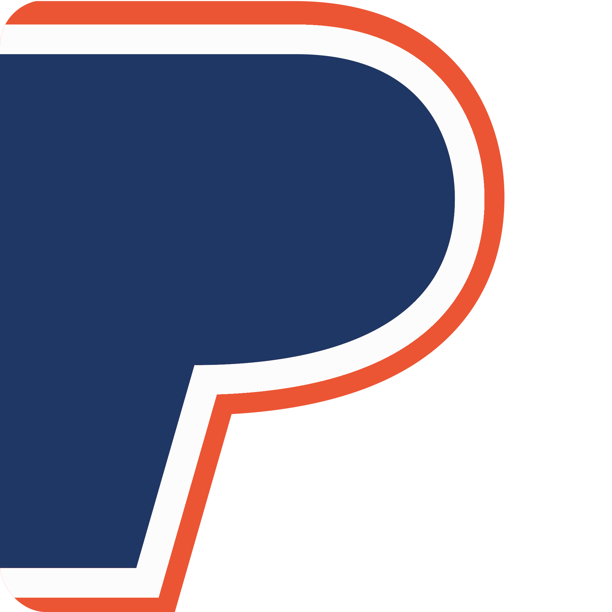

# CSS: Styliser une page

Apprendre à styliser vos pages web en utilisant le CSS.

Maintenant nous allons utiliser toutes les fonctionnalités CSS vues dans les chapitres pécedents, pour styliser une page web.

[Suivre tous les tutoriels sur mon site:](https://djemai-samy.com/posts/0.css-initiation)

- [CSS: Introduction](https://djemai-samy.com/posts/1.css-introduction.article)
- [CSS: Sélécteurs](https://djemai-samy.com/posts/2.css-selectors.article)
- [CSS: Boites](https://djemai-samy.com/posts/3.css-box.article)
- [CSS: Transformations](https://djemai-samy.com/posts/4.css-transformations.article)
- [CSS: Animations](https://djemai-samy.com/posts/5.css-animations.article)
- [CSS: Styliser une page](https://djemai-samy.com/posts/6.css-page.article)

---

## Prérequis

Il est conseillé d'avoir suivi la première parti de ce tutoriel: [CSS: Introduction](https://djemai-samy.com/posts/1.css-introduction.article)

---

## Structure du projet

Nous allons reprendre la page que nous avions implémenté lors de ce tutoriel:

[Créer une page web avec HTML.](https://djemai-samy.com/posts/5.html-page.article)

Et nous allons ajouter un fichier CSS nommé `style.css`

```bash
📦6.css-page
┣ 📂images
┃ ┣ 📜JohnDoe.png
┃ ┣ 📜logo.svg
┃ ┗ 📜LoremIpsum.png
┣ 📜favicon.ico
┣ 📜style.css
┗ 📜index.html
```

---

## 1/ Le head

Pour commencer, nous allons lier notre fichier CSS dans le document HTML:

```html
<head>
  <meta charset="utf-8" />

  <!--Image afficher dans la barre d'onglet-->
  <link rel="icon" href="./favicon.ico" />

  <!--Titre du site affiché dans la barre d'onglet-->
  <title>BRAND: Acceuil</title>

  <!--Description du site-->
  <meta name="description" content="Déscription de votre site en quelques mots" />

  <!-- Image du site-->
  <meta property="og:image" content="./images/logo.svg" />

  <!--Instructions sur la taille et l’échelle du viewport-->
  <meta name="viewport" content="width=device-width, initial-scale=1.0" />

  <!--Lier notre fichier css pour le style-->
  <link rel="stylesheet" href="./style.css" />
</head>
```

---

## 2/ Style générale

Grâce au sélecteur universel nous pouvons cibler tous les éléments du DOM.

Par exemple, nous pouvons l'utiliser pour enlever les `margin` et `padding` ajoutés par les navigateurs.

Et pour changer la police de tout le texte de la page.

```css
/* 1. Importer un police de texte depuis google */
@import url("https://fonts.googleapis.com/css2?family=Roboto:ital,wght@0,100;0,400;0,900;1,100;1,400;1,900&display=swap");

/* 2. séléctionne tout les éléments du document */
* {
  /* 2-1. Changer la police */
  font-family: "Roboto", sans-serif;

  /* 2-2. Enelver les margin et padding */
  margin: 0;
  padding: 0;
}

/* 3. Sélectionne les input et button */
input,
button {
  padding: 0.6em;
  border-radius: 0.5em;
  border: none;
}
```

- `1`: Nous avons utiliser les [polices gratuites de google](https://fonts.google.com/), et importer la police nommé `Roboto` avec différentes tailles ect...
- `2`: Sélécteur universel, permettant de séléctionner tous les élément pour:
  - `2.1`: changer la police de tout le texte de la page.
  - `2.2`: enlever les `margin` et `padding` ajouté par les navigateurs.
- `3`: Sélecteur de balise, permettant de sélectionner tous les champs utilisateurs et boutons du DOM.

---

### 3/ L'en-tete

Dans notre HTML, nous avons la balise `header` contenant une image, le titre principal de la page et une déscription:

```html
<header>
  <div>
    <!-- Titre visible de la page -->
    <h1>Bienvenue sur BRAND!</h1>

    <!-- Déscription visible de la page -->
    <p>
      Lorem ipsum, dolor sit amet consectetur adipisicing elit. Obcaecati soluta rerum
      quam perspiciatis repudiandae eveniet vero molestiae maxime, veniam expedita,
      aperiam explicabo alias nisi facilis blanditiis, deserunt veritatis nam dolore.
    </p>
  </div>

  <!-- Image visible de la page -->
  
</header>
```

Puis dans notre CSS, nous pouvons styliser le header pour afficher l'image à gauche, et le titre et déscription à droite:

```css
/* 1. Séléctionne la balise header */
header {
  padding: 2em;

  /* 1-1. Met la disposition du contenu en flex */
  display: flex;

  /* 1-2. centre les éléments sur l'axe croisé */
  align-items: center;

  /* 1-3. Inverse l'ordre des éléments */
  flex-direction: row-reverse;

  /*1-4. Ajoute un gradiant comme couleur de fond */
  background: linear-gradient(
    0deg,
    rgba(31, 55, 101, 1) 0%,
    rgba(255, 255, 255, 1) 20%,
    rgba(255, 255, 255, 1) 100%
  );
}

/* 2. Selectionne tout les éléments dans la balise header */
header * {
  color: #1f3765;
}

/* 3. Selectionne les div qui sont des enfants directe du header */
header > div {
  width: 50%;
}

/* 4. Selectionne les img qui sont des enfants directe du header */
header > img {
  width: 50%;
}

h1 {
  font-size: 3em;
  padding: 0.5em 0;
}

header p {
  font-size: 1.2em;
}
```

- `1`: Sélecteur des balises `header`:
  - `1.1`: Afin de mettre les éléments enfants en ligne, nous avons ici utiliser le `display: flex`.
  - `1.2`: Pour center les éléments sur l'axe verticale, nous utilisons ici `align-items: center`.
  - `1.3`: Suivant la disposition des élément dans notre HTML, l'image sera à droite. pour la mettre à gauche, nous inversons l'ordre des éléments avec `flex-direction: row-reverse`.
  - `1.4`: Nous pouvons appliquer un grandiant en couleur de fond des éléments. Voici un [site pour générer des gradiant facilement](https://cssgradient.io/)
- `2`: Sélectionne tous les éléments enfants du header. Nous l'utilisons ici pour changer la couleur de tout les texte du `header`
- `3`: Sélectionne les div qui sont enfants de la balise `header` afin changer sa taille à la moitier de celle du parent.
- `4`: Sélectionne les img qui sont enfantss de la balise `header` afin changer sa taille à la moitier de celle du parent.


---

## 4/ La barre de navigation

Dans le HTML, nous avons l'élément nav:

```html
<!-- La barre de navigation. -->
<nav>
  <!-- Un contenant pour le logo et la marque. -->
  <div>
    
    <span id="brand">BRAND</span>
  </div>

  <!-- Le menu avec des liens et un formulaire. -->
  <div id="menu">
    <!-- Une liste de liens vers d'autre page ou sections. -->
    <ul>
      <li><a href="#">Accueil</a></li>
      <li><a href="#articles">Articles</a></li>
      <li><a href="#contact">Contact</a></li>
    </ul>

    <!-- Un formulaire de recherche afin de naviguer de façon non‑linéaire.-->
    <form>
      <input type="search" name="q" placeholder="Rechercher" />
      <input type="submit" value="Lancer !" />
    </form>
  </div>
</nav>
```

Puis dans le CSS:

```css
/* 1. Sélectionne les balises nav et les éléments avec id=menu */
nav,
#menu {
  display: flex;
  align-items: center;
}

/* 2. Sélectionne les balises nav */
nav {
  padding: 1em;
  background-color: #1f3765;

  /* 2-1. Permet de coller la barre lors du scroll */
  position: sticky;

  /* 2-2. Colle la barre en haut de l'écran aprés le scroll */
  top: 0;

  /* 2-3. ajoute de l'espace entre les éléments */
  justify-content: space-between;
}

nav * {
  color: whitesmoke;
}

/* 3. Sélection les élément avec id=brand */
#brand {
  font-size: 1.5em;
  font-weight: bold;
}

/* 4. Sélectionne les éléments li dans la liste ul enfants direct du menu */
#menu > ul li {
  margin: 0 1em;

  /* 4-1. Change la disposition de l'élément en disposition en ligne */
  display: inline;

  /*4-2. Permet d'enlever le style ajoutés aux éléments d'une liste */
  list-style: none;
}

/* 5. Sélectionne les a contenues dans des li contenues dans les listes ul enfants directe du menu */
#menu > ul li a {
  font-size: 1.2em;

  /*5-1. Enleve le soulignement du texte */
  text-decoration: none;
}

/*6. Sélectionne l'élément avant et aprés le contenu de la liste contenu dans l'élément avec id=menu */
#menu ul::before,
#menu ul::after {
  content: "";
  border-left: 2px solid whitesmoke;
  margin: 0 1em;
}

/* 7. Les input possédant l'attribut type="submit" ET les button contenus dans la nav  */
nav input[type="submit"],
button {
  background-color: #ec5534;
  color: whitesmoke;
  transition: background-color 0.2s ease-in-out;
}

/* 8. Séléctionne les button quand la souris est dessus */
nav input[type="submit"]:hover {
  background-color: #ed907b;
  transition: background-color 0.2s ease-in-out;
}
```

- `1`: Sélecteur logique `ET` permettant de sélectionner plusieurs éléments.
- `2`: Sélectionne toute la barre de navigation:
  - `2.1`: Nous pouvons faire en sorte de coller la barre sur l'écran quand l'utilsateur scroll avec: `position: sticky`.
  - `2.2`: Nous voulons coller la barre en haut de l'écran, on utilise donc `top: 0px`.
  - `2.3`: Nous voulons aussi séparer le logo et le nom de marque, des liens et champ de recherche, nous utilisons donc `justify-content:space-between`.
- `3`: Sélectionne d'élément par identifiant pour ciblé l'élément avec `id="brand"`.
- `4`: Sélectionne les éléments dans la liste enfant direct du menu.
  - `4.1`: Nous voulons mettre en ligne les éléments de liste contenant les liens de la page.
- `5`: Sélectionne les liens `a` contenus dans les éléments `li` contenus dans les listes `ul` enfants directe du menu
  - `5.1`: Enleve le soulignement du texte.
- `6`: Sélectionne l'élément avant et aprés le contenu de la liste `ul` contenu dans l'élément avec id=menu
- `7`: Sélectionne les champs `input` possédant l'attribut `type="submit"` dans la `nav```, ET tous les boutons.
- `8`: Sélectionne les champs `input` possédant l'attribut `type="submit"` dans la `nav` quand la souris passe dessus.


---

## 5/ Le contenu principale

Dans le HTML, la balise `main` contient des sections (articles, contact), et chacune de ces section possède un titre `h2`, nous allons ajouter du style à tous les titres `h2`:

```css
h2 {
  font-size: 2.2em;
  padding: 0.5em;
  text-align: center;
  color: #ec5534;
}
```

### 5.1/ Les articles

Dans la section articles, nous avons deux article avec pour chacun, un titre `h3`, une description et une image:

```html
<!-- La section des articles -->
<section id="articles">
  <!-- Titre de la section des articles -->
  <h2>Les articles</h2>

  <!-- Un article -->
  <article id="article1">
    <h3>Lorem Ipsum, c'est quoi?</h2>
    
    <div>
    <p>
        La phrase latine "<i>Lorem ipsum dolor sit amet consectetur</i>" est
        utilisée depuis le XVIe siècle par des typographes puis par des graphistes
        pour visualiser l'espace occupé par un texte et tester les différentes
        polices de caractères.
    </p>
    <p>
        L'extrait complet

        <blockquote cite="https://loremipsum.io/fr/">
            'Neque porro quisquam est qui dolorem ipsum quia dolor sit amet,
            consectetur, adipisci velit.'
        </blockquote>

        siginfie

        <blockquote cite="https://fr.wikipedia.org/wiki/Lorem_ipsum">
            'Personne n'aime la douleur en elle-même,
            ne la recherche et ne la souhaite,
            tout simplement parce qu'il s'agit de la douleur.'
        </blockquote>
    </p>
    </div>
  </article>

<!--Balise pour ajouter un ligne de séparation -->
<hr>

<!-- Un deuxiemme article -->
  <article id="article2">
    <h3>Qui est John Doe ?</h2>
    
    <div>
    <p>
        En anglais, <strong>John Doe</strong> (version féminine : Jane Doe) est
        une expression qui désigne <strong>une personne non identifiée</strong>:
        « Monsieur X », « Monsieur Tout-le-monde ».
        Pour les très jeunes enfants, l'équivalent est « Baby Doe »,
        ou encore « Jonnie Doe » ou « Janie Doe ».
    </p>
    </div>
  </article>
</section>
```

Puis dans le CSS:

```css
article {
  display: flex;
  flex-wrap: wrap;
  background-color: rgb(233, 233, 233);
  padding: 1em;
  margin: 1em;
  border-radius: 1em;
}

article > * {
  box-sizing: border-box;
  width: 45vw;
  padding: 1em;
}

article img {
  object-fit: cover;
}

article p {
  font-size: 1.2em;
}

article i {
  color: #ec5534;
  font-weight: bold;
}

article strong {
  color: #ec5534;
}

article h3 {
  width: 100%;
  font-size: 2em;
  text-align: center;
  margin-bottom: 1em;
  padding: 0 0 1em 0;
  border-bottom: 1px solid #1f3765;
}
```


### 5.2/ La section contact

Dans la section contact, nous avons un formulaire permettant de choisir un sujet et d'envoyer un message:

```html
<section id="contact">
  <!-- Titre de la section contact -->
  <h2>Contactez nous</h2>

  <!-- Formulaire de contact -->
  <form action="post">
    <!-- Label et champ pour l'email -->
    <label for="email">Votre adresse mail: </label>
    <input id="email" type="email" name="email" placeholder="exemple@exemple.com" />

    <!-- Groupes de choix du sujet-->
    <fieldset>
      <!--Legende du groupe de champs -->
      <legend>Sujet:</legend>

      <!-- Label et choix pour pour poser une question -->
      <input type="radio" id="question" name="sujet" value="question" />
      <label for="question">Vous avez une question?</label>

      <br />

      <!-- Label et choix pour émettre une réclamation -->
      <input type="radio" id="reclamation" name="sujet" value="reclamation" />
      <label for="reclamation">Vous avez une réclamation?</label>

      <br />

      <input type="radio" id="autre" name="sujet" value="autre" />
      <label for="autre">Autre chose?</label>
    </fieldset>

    <label for="message">Votre message</label>
    <br />
    <textarea name="message" id="message" cols="30" rows="10"></textarea>

    <br />

    <button>Envoyer !</button>
  </form>
</section>
```

Puis dans le CSS:

```css
#contact {
  margin: 1em 0;
}

#contact form {
  background-color: rgb(233, 233, 233);
  padding: 2em;
  margin: auto;
  border-radius: 1em;
  width: 100%;
  max-width: 300px;
  display: flex;
  flex-direction: column;
  align-items: center;
}

label[for="email"] {
  display: none;
}

#contact input {
  margin: 0 0 1em 0;
}

fieldset {
  margin: 1em 0;
  padding: 1em;
}

label[for="message"] {
  font-size: 1.2em;
  text-decoration: underline;
  margin-bottom: 0;
}

input[type="email"],
textarea {
  width: 100%;
}

#contact button {
  min-width: 100px;
}
```


---

## 6/ Le contenu en relation

Dans la balise ```aside```, on met souvent quelques informations autour du sujet, liens, citations, annonces...

```html
<!-- Le contenu « à côté »-->
<aside>
  <h2>En relation:</h2>
  <!-- Liste ordonnés des articles de la page-->
  <ol>
    <!-- En relation avec l'article 1-->
    <li>
      <!-- Lien vers interne l'article 1-->
      <a href="#article1">Lorem Ipsum, c'est quoi?</a>
      <!-- Liste de liens externes en relation avec l'article 1-->
      <ul>
        <li>
          <a href="https://fr.wikipedia.org/wiki/Lorem_ipsum" target="_blank">
            Lorem ipsum sur Wikipedia
          </a>
        </li>
        <li>
          <a href="https://loremipsum.io/" target="_blank">
            Générateur de texte Lorem Ipsum
          </a>
        </li>
      </ul>
    </li>
    <!-- En relation avec l'article 2-->
    <li>
      <!-- Lien interne vers l'article 2-->
      <a href="#article2"> Qui est John Doe ? </a>
      <!-- Liste de liens externes en relation avec l'article 2-->
      <ul>
        <li>
          <a href="https://fr.wikipedia.org/wiki/John_Doe" target="_blank">
            John Doe sur Wikipedia</a
          >
        </li>
        <li>
          <a href="https://ui-avatars.com/" target="_blank"> API générateur d'avatars </a>
        </li>
      </ul>
    </li>
  </ol>
</aside>
```

Puis dans le CSS:

```css
aside {
  background-color: #e4e4e4;
  padding: 1em;
}

aside ol {
  padding: 1em;
}

aside ol > li {
  border-top: 1px solid #1f3765;
  border-bottom: 1px solid #1f3765;
  padding: 1em;
}
aside ol > li > a {
  font-size: 1.5em;
  font-weight: bold;
  color: #ec5534;
}

aside ul > li > a {
  font-size: 1.1em;
  color: #1f3765;
}
```


---

## 7/ Le pied de page

Et enfin pour le pied de page:

```html
<!-- Le pied de page utilisé sur toutes les pages -->
<footer>
  <p>©Copyright 2050 par personne. Tous droits reversés.</p>
</footer>
```

Puis dans le CSS:

```css
footer {
  background-color: #1f3765;
  color: whitesmoke;
  padding: 3em;
  margin: 0;
}
```

---

## Resultat de la page complète


## Conclusion

Ce chapitre conclut la série d'initiation au CSS.

Le CSS nous permet de styliser nos pages web de manière très complexe, nous avons donc couvert que les bases du langage.

Vous trouverez dans la section CSS plusieurs autres tutoriels, pour approfondir vos connaissances et apprendre des techniques avancées.

Sinon, pour l'étape d'après, il est temps de passer au Javascript. De connaître les bases de ce langage de programmation et comment l'utiliser pour ajouter de l'interaction dans nos pages, et les rendre plus dynamiques.

---

## Aller plus loin

[Précédent: CSS: Les Boîtes](https://djemai-samy.com/posts/4.css-transformations.article)

[Suivant: CSS: Styliser une page](https://djemai-samy.com/posts/6.css-page.article)
